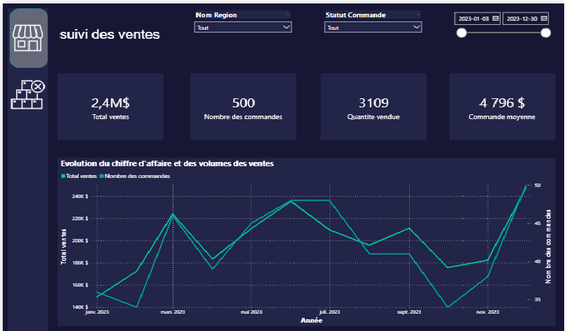
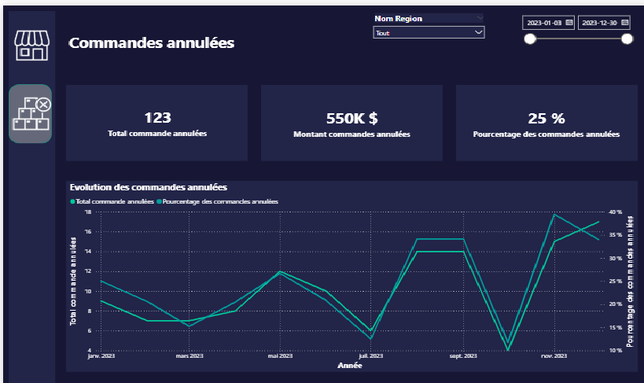

# Power BI Sales Dashboard

## Project Overview

This project presents an interactive Power BI dashboard designed to analyze sales performance, order trends, and cancelled orders.

The dashboard provides a clear overview of key business indicators such as total sales, number of orders, quantity sold, average order value, and cancelled orders.

## Objectives

- Analyze sales performance using interactive visualizations
- Track total sales, number of orders, quantity sold, and average order value
- Monitor cancelled orders and their impact on business performance
- Provide clear insights to support business decision-making

## Tools Used

- Power BI Desktop
- Power Query
- DAX
- Data visualization
- Business intelligence
## Dashboard Preview

### Sales Overview

### Cancelled Orders

